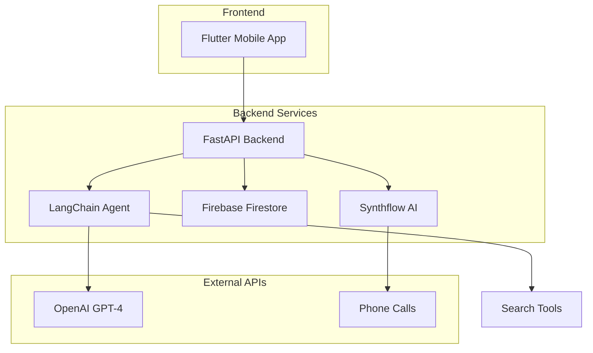

# TelliProcure - AI-Driven Procurement Assistant

TelliProcure is an AI‑driven procurement assistant that lets you simply specify what you need and it takes care of the rest—scanning the market for dozens of vendors, comparing prices, availability and service quality; narrowing down the top candidates based on your preferences; reaching out to each one by phone or email to request quotes, confirm specifications and negotiate terms; and finally placing the actual order so you get the best deal with virtually no legwork. By combining automated research with seamless outreach, it saves you time, drives down costs and keeps your entire sourcing process organized end‑to‑end.

   

## 🚀 Features

### Core Capabilities
- **Natural Language Processing**: Describe your procurement needs in plain English
- **Intelligent Market Research**: AI-powered vendor discovery and comparison
- **Automated Outreach**: Phone and email communication with suppliers
- **Real-time Negotiation**: AI handles quote requests and term negotiations
- **End-to-end Procurement**: From specification to order placement
- **Cost Optimization**: Automatically finds the best deals and pricing
- **Quality Assessment**: Evaluates vendor service quality and reliability

### Technical Features
- **Cross-platform Mobile App**: Built with Flutter for iOS and Android
- **Real-time Communication**: Firebase-powered messaging and updates
- **AI Agent Integration**: LangChain-powered conversational AI
- **Voice Call Integration**: Synthflow AI for automated phone calls
- **Scalable Backend**: FastAPI with async support
- **Cloud Database**: Firebase Firestore for real-time data sync

## 🏗️ Architecture



## 📱 Frontend (Flutter)

### Technologies Used
- **Flutter**: Cross-platform mobile development framework
- **Firebase Core**: Firebase integration and authentication
- **Cloud Firestore**: Real-time database for messaging
- **Riverpod**: State management solution
- **Material Design 3**: Modern UI components
- **Audio Players**: For playing call recordings
- **URL Launcher**: For external links and actions

### Key Components
- **Tasks Page**: Main dashboard for managing procurement tasks
- **Messages Page**: Real-time conversation interface with AI agent
- **Task Management**: Create, track, and manage procurement requests
- **Real-time Updates**: Live updates on vendor outreach and responses

### Setup Instructions

1. **Prerequisites**
   ```bash
   # Install Flutter SDK
   # https://docs.flutter.dev/get-started/install
   
   # Verify installation
   flutter doctor
   ```

2. **Install Dependencies**
   ```bash
   cd flutter
   flutter pub get
   ```

3. **Firebase Configuration**
   - Add your `google-services.json` (Android) and `GoogleService-Info.plist` (iOS)
   - Configure Firebase project with Firestore enabled

4. **Run the App**
   ```bash
   # Debug mode
   flutter run
   
   # Release mode
   flutter run --release
   
   # Specific platform
   flutter run -d ios
   flutter run -d android
   ```

## 🔧 Backend (FastAPI + LangChain)

### Technologies Used
- **FastAPI**: Modern, fast web framework for building APIs
- **LangChain**: Framework for building AI agent applications
- **OpenAI GPT-4**: Large language model for conversational AI
- **Firebase Admin SDK**: Backend Firebase integration
- **Synthflow AI**: Automated phone call service
- **Uvicorn**: ASGI server for FastAPI

### Core Services

#### 1. Agent Service (`services/agent.py`)
- **LangChain Integration**: Manages conversational AI agents
- **Session Management**: Handles conversation context and memory
- **Order Processing**: Processes procurement requests and generates responses
- **Firebase Integration**: Syncs conversations with Firestore

#### 2. Phone Call Executor (`services/phone_call_executor.py`)
- **Automated Calling**: Executes phone calls to selected vendors
- **Call Management**: Tracks call status and results
- **Transcript Processing**: Handles call recordings and transcripts
- **Status Updates**: Real-time updates on call progress

#### 3. Firestore Service (`services/firestore_service.py`)
- **Database Operations**: Handles all Firebase Firestore interactions
- **Message Management**: Stores and retrieves conversation messages
- **Task Management**: Manages procurement task data

#### 4. Search Tools (`tools/search_tools.py`)
- **Vendor Discovery**: AI-powered business and service search
- **Market Research**: Finds and compares potential suppliers
- **Structured Results**: Returns formatted vendor information

### API Endpoints

#### Core Endpoints
- `POST /order` - Process procurement requests through AI agent
- `POST /execute-phone-calls` - Execute calls to selected vendors
- `GET /get-selected-options-status` - Get current status of vendor outreach
- `POST /synthflow-call` - Make individual Synthflow calls
- `GET /synthflow-call/{call_id}` - Get call information and results

#### Health & Testing
- `GET /healthz` - Basic health check
- `GET /firestore-test` - Test Firebase connection
- `POST /task-last-message` - Get latest task message

### Setup Instructions

1. **Prerequisites**
   ```bash
   # Python 3.8+ required
   python --version
   
   # Install pip and virtualenv
   pip install virtualenv
   ```

2. **Environment Setup**
   ```bash
   cd backend
   python -m venv venv
   source venv/bin/activate  # On Windows: venv\Scripts\activate
   pip install -r requirements.txt
   ```

3. **Environment Configuration**
   ```bash
   cp env.example .env
   ```
   
   Configure your `.env` file:
   ```env
   # OpenAI Configuration
   OPENAI_API_KEY=your_openai_api_key_here
   OPENAI_MODEL=gpt-4.1
   SEARCH_MODEL=o3
   OPENAI_TEMPERATURE=0.3
   
   # Firebase Configuration
   FIREBASE_ADMIN_KEY=your_firebase_admin_key_json
   
   # Synthflow Configuration
   SYNTHFLOW_API_KEY=your_synthflow_api_key
   
   # Server Configuration
   HOST=0.0.0.0
   PORT=8000
   ```

4. **Run the Server**
   ```bash
   # Development
   python main.py
   
   # Or using uvicorn directly
   uvicorn main:app --reload --host 0.0.0.0 --port 8000
   
   # Production
   gunicorn main:app -w 4 -k uvicorn.workers.UvicornWorker
   ```

5. **Test the API**
   ```bash
   # Health check
   curl http://localhost:8000/healthz
   
   # Test conversation processing
   python cli.py "I need catering for 50 people next week"
   ```

## 🔄 How It Works

### 1. User Input Processing
1. User describes procurement need in Flutter app
2. Message sent to FastAPI backend via HTTP POST
3. LangChain agent processes natural language request
4. AI asks clarifying questions if needed

### 2. Vendor Discovery
1. When sufficient information gathered, agent triggers search
2. Search tools query market for relevant vendors
3. AI evaluates and ranks potential suppliers
4. Returns top 5-10 vendor options with contact details

### 3. Automated Outreach
1. User selects preferred vendors from AI recommendations
2. Phone Call Executor initiates Synthflow calls
3. AI agents contact vendors with sourcing requirements
4. Real-time status updates sent to mobile app

### 4. Results Processing
1. Call recordings and transcripts automatically processed
2. AI extracts key information (pricing, availability, terms)
3. Results compiled and presented to user
4. User can proceed with best option or request more information

## 🚀 Deployment

### Backend Deployment (Heroku)
```bash
# Deploy to Heroku
git add .
git commit -m "Deploy TelliProcure backend"
git push heroku main

# Set environment variables
heroku config:set OPENAI_API_KEY=your_key
heroku config:set FIREBASE_ADMIN_KEY=your_firebase_key
heroku config:set SYNTHFLOW_API_KEY=your_synthflow_key
```

### Frontend Deployment
```bash
# Build for production
flutter build apk --release  # Android
flutter build ios --release  # iOS

# Deploy to app stores or distribute APK
```

## 🧪 Testing

### Backend Tests
```bash
cd backend
pytest tests/ -v
python -m pytest tests/test_services.py
```

### Frontend Tests
```bash
cd flutter
flutter test
```

### Manual Testing
```bash
# Test CLI interface
cd backend
python cli.py "I need office supplies for 30 employees"

# Test API endpoints
curl -X POST http://localhost:8000/order \
  -H "Content-Type: application/json" \
  -d '{"task_id": "test_task_123"}'
```

## 📊 Monitoring & Logging

The application includes comprehensive logging for debugging and monitoring:

- **Request/Response Logging**: All API calls logged with timestamps
- **AI Agent Interactions**: LangChain agent conversations tracked
- **Phone Call Status**: Real-time call progress and results
- **Error Handling**: Detailed error messages and stack traces
- **Performance Metrics**: Response times and system health

## 🔒 Security

- **API Key Management**: Secure environment variable handling
- **Firebase Security Rules**: Proper database access controls
- **Input Validation**: Pydantic schemas for request validation
- **CORS Configuration**: Controlled cross-origin requests
- **Rate Limiting**: Protection against API abuse

## 🤝 Contributing

1. Fork the repository
2. Create a feature branch (`git checkout -b feature/amazing-feature`)
3. Commit your changes (`git commit -m 'Add amazing feature'`)
4. Push to the branch (`git push origin feature/amazing-feature`)
5. Open a Pull Request

## 📄 License

This project is licensed under the MIT License - see the [LICENSE](LICENSE) file for details.

## 🆘 Support

For support and questions:
- Create an issue in the GitHub repository
- Check the [documentation](docs/)
- Review the [API documentation](http://localhost:8000/docs) when running locally

## 🔮 Future Roadmap

- [ ] **Email Integration**: Automated email outreach to vendors
- [ ] **Contract Management**: AI-powered contract review and negotiation
- [ ] **Multi-language Support**: Support for international procurement
- [ ] **Advanced Analytics**: Procurement insights and cost analysis
- [ ] **Integration APIs**: Connect with existing ERP and procurement systems
- [ ] **Vendor Rating System**: Community-driven supplier ratings
- [ ] **Bulk Procurement**: Handle large-scale, multi-item orders
- [ ] **Payment Integration**: End-to-end payment processing

---

**TelliProcure** - Revolutionizing procurement through AI automation 🤖✨ 